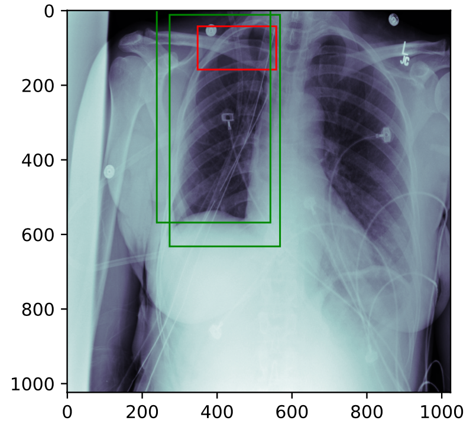

# Screening X-ray images
Fit a series of DICOM X-ray images to Faster R-CNN using an alternating training procedure.

```shell
# approximate region proposal network
python rpn_training.py -epoch 250 -batch 16
```


## Region Proposals
The proposed regions of the [RPN Head](docs/Resnet18-RPNHead.png) after non-maximum suppression are outlined in green. The ground truth is within the red bounding box.


